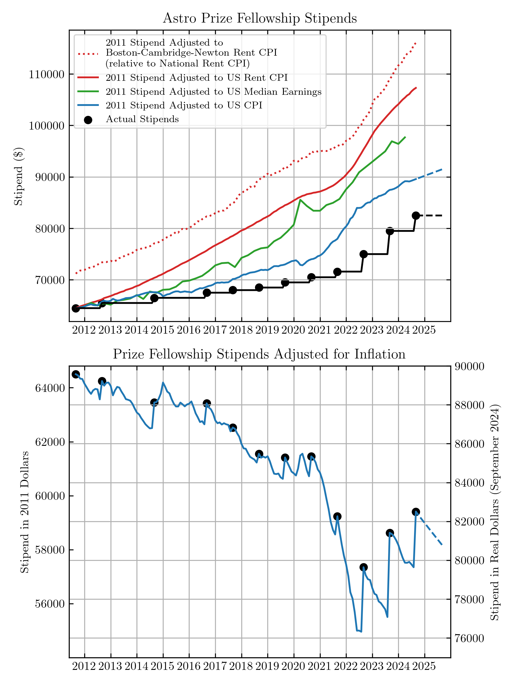

## Data and script for making the following plot:

	

## Data Sources

Consumer Price Index: https://fred.stlouisfed.org/series/CPIAUCSL

Rent Consumer Price Index: https://fred.stlouisfed.org/series/CUSR0000SEHA

Median Weekly Earnings: https://fred.stlouisfed.org/series/LES1252881500Q

Rent CPI for Boston-Cambridge-Newton: https://fred.stlouisfed.org/series/CUURA103SEHA
